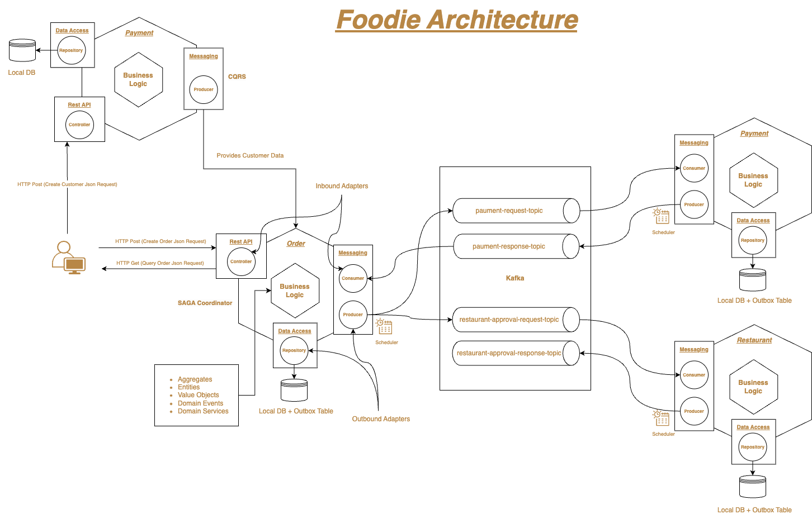

# Foodie Project

This project, named "Foodie", is a demonstration of various concepts in software development, including Microservices with Spring Boot, Clean Architecture, Domain-Driven Design (DDD), SAGA, Outbox, Kafka, and Maven multi-module.

## Overview

Foodie is a system that aims to provide a platform for food lovers to explore, discover, and order food. It consists of multiple microservices, each responsible for a specific aspect of the overall system. The project follows the principles of Clean Architecture and Domain-Driven Design to ensure a modular, scalable, and maintainable codebase.

## High Level Architecture

## Concepts Used

- Clean Architecture
- DDD (Domain-Driven Design)
- SAGA (Saga Pattern)
- Outbox Pattern
- Kafka
- Maven Multi-Module

## Docker

```sh
docker run --name postgres -p 5432:5432 -e POSTGRES_USER=admin -e POSTGRES_PASSWORD=nimda -d postgres:15-alpine
```


